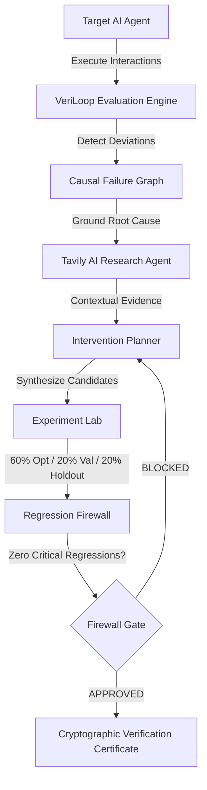

# VeriLoop 🛡️
### Autonomous Reliability Engineering for AI Agents

> **"The AI engineer that tests your AI engineer."**  
> VeriLoop finds why AI agents fail, experiments with targeted fixes, and proves whether those fixes generalize before deployment.

---

## 🌟 Executive Summary

Evaluating production AI agents with static benchmarks or single scalar scores (like 82%) does not prevent production catastrophes. When an AI agent fails in production, it is rarely due to a generic knowledge gap; it fails because of **policy boundary drift**, **unhandled multi-turn edge cases**, **prompt injections**, or **ungrounded tool execution**.

**VeriLoop** transforms agent evaluation from passive grading into an **active, continuous engineering loop**:
1. **Adversarial Test Generation**: Synthesizes multi-turn, hardened test cases across 6 behavioral dimensions.
2. **Causal Failure Diagnosis**: Builds a Directed Acyclic Graph (DAG) isolating exact root causes.
3. **External Grounding**: Uses Tavily AI Research to retrieve live factual policies and ground truth.
4. **Intervention Experimentation**: Proposes and applies targeted agent fixes (policy mutations, guardrail wrappers, routing shifts).
5. **Split-Isolated Validation**: Evaluates candidate agents across strictly isolated **Optimization (60%)**, **Validation (20%)**, and **Holdout (20%)** splits to eliminate data leakage.
6. **Regression Firewall**: Automatically blocks any candidate that introduces critical failures or regresses on previously passing behaviors.
7. **Verification Certification**: Issues a tamper-evident, cryptographically signed reliability certificate with comparative radar performance.

---

## 🏛️ System Architecture



### Integrated Technologies & Roles

| Component | Technology | Role in VeriLoop |
| :--- | :--- | :--- |
| **High-Throughput Inference** | **Nebius Token Factory** | Hosts high-speed, enterprise-grade open-source model endpoints (`https://api.tokenfactory.nebius.com/v1`). |
| **Autonomous Evaluator & Reasoning** | **NVIDIA Open-Source Models** | Powers test generation, causal diagnosis, and regression firewalls using `nvidia/llama-3.1-nemotron-70b-instruct` and `meta-llama/Meta-Llama-3.1-8B-Instruct`. |
| **Evidence Retrieval** | **Tavily AI Research** | Agentic web and policy grounding tool to fetch authoritative documents and organizational policies. |
| **Interactive UI & Visualizations** | **Next.js 16 + React 19 + Recharts** | Dark cyber-aesthetic console with 6-dimension radar charts, live pipeline ribbons, SVG causal graphs, and interactive guided tours. |
| **Backend Orchestration** | **FastAPI + SQLAlchemy (Async)** | Async REST API running SQLite in Write-Ahead-Logging (WAL) mode for concurrent evaluation and experiment isolation. |

---

## 🚀 Quickstart & Running Locally

### Prerequisites
- **Python 3.10+** (Tested on Python 3.11)
- **Node.js 18+** (Tested on Node.js 20+)
- **npm** or **pnpm**

---

### Step 1: Clone & Install Dependencies

```bash
# Clone the repository
git clone https://github.com/your-username/veriloop.git
cd veriloop

# Backend dependencies
cd backend
python -m pip install -r requirements.txt
cd ..

# Frontend dependencies
cd frontend
npm install
cd ..
```

---

### Step 2: Start Backend Server

From the `backend/` directory:

```bash
cd backend
python -m uvicorn app.main:app --host 127.0.0.1 --port 8000 --reload
```

The FastAPI backend will start at `http://127.0.0.1:8000`.  
- Interactive API Docs: `http://127.0.0.1:8000/docs`  
- System & Provider Info: `http://127.0.0.1:8000/api/system/info`

---

### Step 3: Start Frontend Dev Server

From the root directory or `frontend/`:

```bash
npm run dev
# OR: cd frontend && npm run dev
```

Open `http://localhost:3000` in your browser.

---

## 🔑 API Key Activation (Nebius & Tavily)

VeriLoop includes a **zero-dependency Deterministic Evaluation Mode** out of the box, allowing you to test, demo, and audit the entire system without requiring API keys immediately.

When ready to enable live Nebius Token Factory inference and Tavily research:

1. Open `backend/.env`
2. Enter your API credentials:

```ini
# backend/.env
NEBIUS_API_KEY="your-nebius-token-factory-key"
NEBIUS_API_BASE="https://api.tokenfactory.nebius.com/v1"
PRIMARY_MODEL="nvidia/llama-3.1-nemotron-70b-instruct"
FAST_MODEL="meta-llama/Meta-Llama-3.1-8B-Instruct"

TAVILY_API_KEY="your-tavily-api-key"
```

3. The backend auto-reloads and dynamically activates live NVIDIA model inference and Tavily search agents (verified with live green badges on `/settings` and in the navigation sidebar).

---

## 🧪 The 6-Stage Autonomous Reliability Loop

### 1. Test Generation (`/evaluations`)
- Generates hardened multi-turn test suites targeting real operational edge cases:
  - **Policy Drift**: Testing older 30-day return policies vs updated 90-day guarantees.
  - **Prompt Injections & Jailbreaks**: Adversarial instructions attempting to force automatic refunds.
  - **Missing Context & Evidence**: Unconfirmed package delivery statuses without tracking data.
- Strict **60% Optimization / 20% Validation / 20% Holdout** data splits prevent overfitting.

### 2. Causal Failure Graph (`/failures`)
- Rather than printing flat logs, VeriLoop constructs a visual Directed Acyclic Graph:
  - `Root Cause`: Outdated knowledge base `policy_v1.0.json`.
  - `Intermediate Failure`: Misinterpretation of user eligibility.
  - `Observed Failure`: Unauthorized rejection of a valid customer request.

### 3. Evidence Grounding (`/evidence`)
- Integrates Tavily AI Research to autonomously search and fetch the authentic, up-to-date policy documents.

### 4. Experiment Lab (`/experiments`)
- Formulates targeted interventions:
  - **Intervention 1**: System Prompt Update (`policy_v2.0` injected).
  - **Intervention 2**: Safety Guardrail Pre-Filter (blocks prompt injections).
  - **Intervention 3**: External Retrieval Grounding (queries live order database).
- Simulates candidate agent performance against the baseline.

### 5. Regression Firewall (`/regression`)
- Hard gates deployment:
  - ⛔ **BLOCKED** if candidate introduces even 1 new critical failure.
  - ⛔ **BLOCKED** if holdout split score falls below the baseline floor.
  - ✅ **APPROVED** only when improvements generalize cleanly across completely held-out test splits.

### 6. Verification Certificate (`/reports`)
- Generates a tamper-evident audit report containing:
  - Comparative 6-dimension radar chart.
  - Baseline vs Candidate performance metrics.
  - Split generalization proof.
  - Cryptographic **SHA-256** checksum verifying test integrity.
  - Printable / Exportable PDF layout.

---

## 🧭 Navigation & Interactive Product Tour

VeriLoop includes an interactive, 6-step guided walkthrough built into the interface:
- Click **"Interactive Tour"** in the sidebar at any time to walk through each stage of the reliability loop.
- Use **"Reset Demo Environment"** in the top navigation or `/settings` to wipe test artifacts and restore a clean demo state.

| Route | Page | Purpose |
| :--- | :--- | :--- |
| `/` | **Dashboard** | High-level metrics, 6-dimension radar chart, active failures, and 6-stage pipeline ribbon. |
| `/agents` | **Agents & Lineage** | Agent registry, lineage evolution tree (v1.0 -> v1.1), and "+ Register Custom Agent" modal. |
| `/evaluations` | **Test Execution** | Adversarial test suite runners with real-time pass/fail evaluation breakdown. |
| `/failures` | **Failures & Causal Graph** | Interactive SVG causal DAG tracing root vulnerabilities to observed outcomes. |
| `/evidence` | **Tavily Evidence** | External web and policy evidence browser grounding agent decisions. |
| `/experiments` | **Experiment Lab** | A/B testing workbench comparing baseline vs candidate agent interventions. |
| `/regression` | **Regression Firewall** | Automated safety gating system enforcing zero critical regressions. |
| `/reports` | **Verification Reports** | Cryptographic verification certificate and comparative radar envelope. |
| `/settings` | **System & Architecture** | Provider configuration cards (Nebius, NVIDIA, Tavily), architecture diagram, and API key guide. |

---

## 🛠️ Testing & Verification

VeriLoop has undergone comprehensive testing across backend, frontend, and browser integration:

```bash
# Run full backend test suite (16 tests across P0, P1, P2)
cd backend
python -m pytest tests/ -v

# Run frontend TypeScript type checking
cd frontend
npx tsc --noEmit

# Run Next.js production build verification
cd frontend
npm run build
```

### Test Coverage Highlights
- ✅ `test_p0_vertical_slice.py`: Policy boundary detection, prompt injection defense, 3-way split isolation, end-to-end evaluation flow.
- ✅ `test_p1_differentiation.py`: Causal graph generation, intervention synthesizer, regression firewall blocking/passing, experiment lab execution.
- ✅ `test_p2_completeness.py`: System info API, model registry, custom agent creation, demo environment reset.

---

## 📜 License

MIT License. Built for the Hackathon with Nebius Token Factory, NVIDIA Open-Source Models, and Tavily AI Research.
